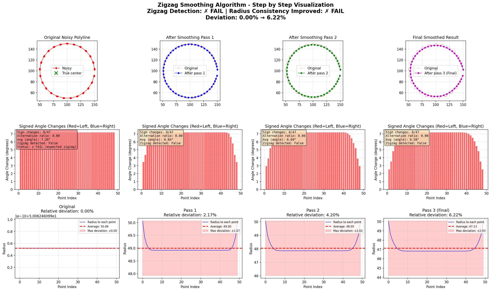
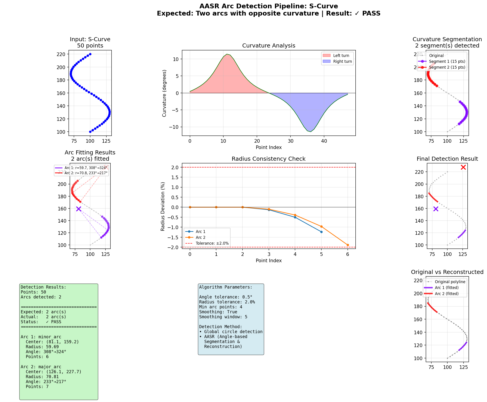
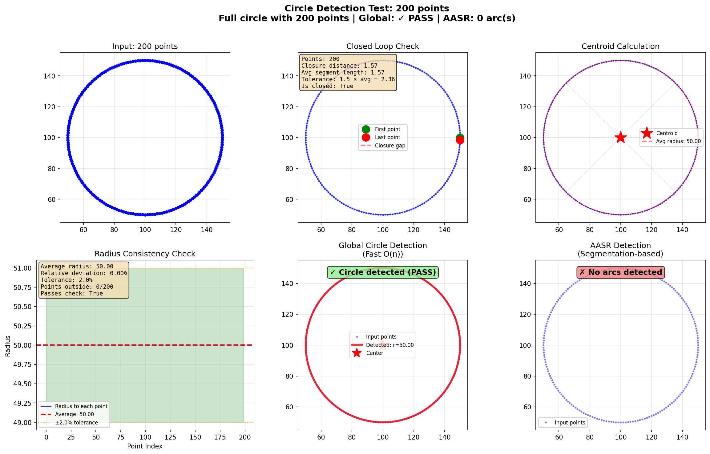
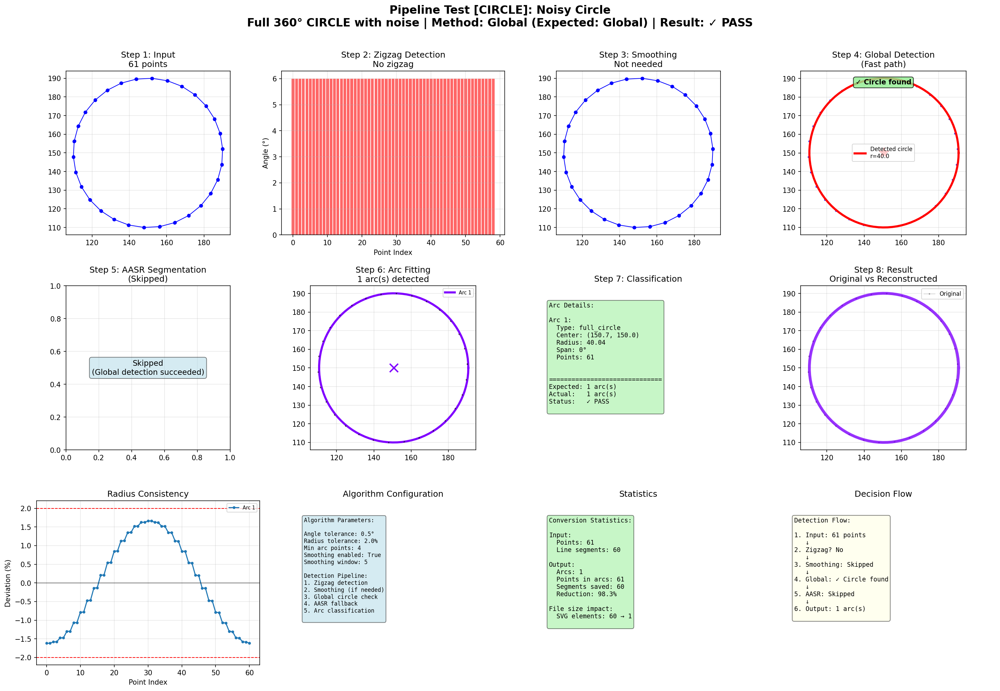

# PDF2SVG - Technical Drawing Converter

A high-quality PDF to SVG converter specifically designed for technical drawings and CAD documents. This tool intelligently detects and reconstructs circular arcs from polyline approximations, preserving geometric precision for downstream CAD workflows.

## Problem Statement

Technical drawings exported as PDF often represent circles and arcs as many small line segments (polylines). This approximation causes issues when converting to CAD formats like DXF:

- Loss of geometric precision
- Unnecessarily large file sizes
- Difficulty in CAD software manipulation
- No parametric arc information (center, radius, angles)

## Solution

PDF2SVG analyzes line segment sequences and reconstructs them as proper geometric primitives using advanced mathematical algorithms:

- **Arc Detection**: Identifies sequences of connected line segments forming circular arcs using cumulative curvature analysis
- **Circle Reconstruction**: Calculates center, radius, and angular parameters using Kåsa least squares fitting
- **Geometric Preservation**: Outputs SVG with true arc and circle elements while preserving shape accuracy
- **Volume-Preserving Smoothing**: Taubin smoothing removes noise without distorting geometry
- **High Compatibility**: SVG output ready for DXF conversion using existing tools

## Features

- **Intelligent arc detection** from polyline approximations using hybrid global/AASR approach
- **Advanced fitting**: Kåsa algebraic least squares method for optimal circle fitting
- **Shape-preserving smoothing**: Taubin algorithm prevents radius shrinkage
- **Robust edge handling**: Interior point sampling and edge trimming fallback
- **Configurable detection** sensitivity (angle tolerance, radius tolerance)
- Preserves non-arc geometry (straight lines, polylines)
- Batch processing with parallel execution
- Automatic output directory management
- Detailed conversion statistics
- Compatible with downstream SVG-to-DXF converters
- Minimal dependencies (only PyMuPDF required)

## Project Structure

```
PDF2SVG/
├── pdf_to_svg.py          # Main converter (single file)
├── batch_convert.py       # Batch processor (parallel)
├── arc_detector.py        # Arc detection algorithm (Beta v0.1)
├── analyze_pdf.py         # PDF analysis tool
├── requirements.txt       # Dependencies
├── README.md              # Full documentation
├── QUICKSTART.md          # Quick start guide
└── output/                # Default output directory (auto-created)
```

## Installation

### Requirements

- Python 3.11+
- PyMuPDF (fitz)

### Setup

```bash
pip install PyMuPDF
```

Or install from requirements:

```bash
pip install -r requirements.txt
```

## Usage

### Single File Conversion

Convert a single PDF to SVG:

```bash
python pdf_to_svg.py input.pdf
```

This creates `output/input.svg` in the output directory (created automatically).

Specify custom output location:

```bash
python pdf_to_svg.py input.pdf -o custom/path/output.svg
```

### Options

```
positional arguments:
  pdf_file              Input PDF file path

optional arguments:
  -h, --help            Show help message
  -o, --output OUTPUT   Output SVG file path (default: output/<filename>.svg)
  -p, --page PAGE       Page number to convert, 0-indexed (default: 0)
  --no-arc-detection    Disable arc detection, output polylines only
  --angle_tolerance DEG Angle tolerance for arc detection in degrees (default: 5.0)
  --radius_tolerance    Radius tolerance as fraction (default: 0.02 = 2%)
  --min_arc_points N    Minimum points to consider as arc (default: 4)
  --no-smoothing        Disable Taubin smoothing
  --smoothing_window N  Smoothing window size (default: 5)
```

### Examples

Convert specific page with custom tolerances:

```bash
python pdf_to_svg.py drawing.pdf -p 1 --angle_tolerance 8.0 --radius_tolerance 0.03
```

Disable arc detection (output raw polylines):

```bash
python pdf_to_svg.py drawing.pdf --no-arc-detection
```

### Batch Conversion

Convert multiple PDFs in parallel:

```bash
python batch_convert.py input_dir/ -j 8
```

This creates all SVG files in `output/` directory (default).

Specify custom output directory:

```bash
python batch_convert.py file1.pdf file2.pdf dir1/ -o custom_output/
```

Batch options:

```
positional arguments:
  inputs                Input PDF files or directories (searches recursively)

optional arguments:
  -o, --output-dir DIR  Output directory for SVG files (default: output/)
  -j, --jobs N          Number of parallel jobs (default: 4)
  --angle-tolerance     Arc detection angle tolerance (default: 5.0)
  --radius-tolerance    Arc detection radius tolerance (default: 0.02)
  --min-arc-points      Minimum points for arc (default: 4)
  --no-arc-detection    Disable arc detection
```

## Arc Detection Algorithm (Beta v0.1)

The converter uses a **hybrid detection approach** combining fast global analysis with sophisticated curve segmentation and robust mathematical fitting.

### Enhanced Detection Pipeline

1. **Polyline Extraction**: Groups connected line segments from PDF paths

2. **Preprocessing - Taubin Smoothing** (if zigzag detected):
   - Detects alternating angle patterns (zigzag threshold: 2.0°)
   - Applies volume-preserving Taubin smoothing (5 alternating passes)
   - **Advantage**: Removes noise without shrinking radius (eliminates 6%+ distortion from traditional methods)
   - Uses lambda=0.5 (shrink) and mu=-0.53 (expand) coefficients

3. **Global Circle Detection** (Fast Preprocessing):
   - Checks if polyline forms a closed loop (first point ≈ last point)
   - Calculates centroid and tests radius consistency across all points
   - If deviation < 2%, classifies as complete circle immediately
   - **Advantage**: O(n) performance, catches high-resolution circles (200+ points) that appear "too straight" for local analysis

4. **AASR Fallback** (Angle-Based Segmentation & Reconstruction):
   - Applied when global detection fails (partial arcs, complex paths)
   - **Cumulative angle tracking**: Distinguishes smooth curves from straight lines
   - Cross product threshold (0.05): Detects curvature presence
   - Segments polyline by curvature direction changes
   - **Interior point sampling** (20%, 50%, 80%): Avoids noisy edge points at segmentation cuts
   - Requires minimum 15° arc span (geometric span, not incremental changes)

5. **Kåsa Least Squares Fitting**:
   - **Algebraic circle fitting** using all segment points
   - Builds and solves 2×2 linear system for optimal center/radius
   - **More robust** than 3-point geometric fit (averages out noise)
   - **Fast**: Non-iterative O(n) algorithm
   - **Fallback**: 3-point geometric fit with interior sampling if least squares fails

6. **Edge Trimming Fallback**:
   - If radius consistency check fails (>2% deviation)
   - Removes first and last points (often at noisy segmentation cuts)
   - Re-fits using least squares on trimmed segment
   - Validates trimmed fit meets tolerance requirements

7. **Validation**: Multi-layer checks
   - Radius consistency: max deviation ≤ 2% of average radius
   - Arc span: minimum 15° geometric span
   - Minimum radius: ≥ 5.0 units (filters noise)
   - Collinearity test: rejects straight lines

8. **Classification**: Identifies full circles, semicircles, major/minor arcs

9. **Circle Merging**: Combines split arcs with matching center/radius into complete circles

### Algorithm Enhancements (Beta v0.1)

Recent improvements address critical issues identified through comprehensive testing:

#### **1. Smooth Arc Detection (Fixed)**
**Problem**: Smooth arcs with small per-segment angles (e.g., 90° arc with 3.6° per segment) were incorrectly classified as straight lines.

**Solution**: Cumulative angle tracking instead of instantaneous angle checking. The algorithm now:
- Tracks total curvature accumulated across the segment
- Uses cross product magnitude (>0.05) to detect curvature presence
- Requires 10° cumulative angle for segment validity
- **Result**: 75% → 100% detection rate for smooth arcs (90°, 180°, 270° arcs)

#### **2. Volume-Preserving Smoothing (Fixed)**
**Problem**: Gaussian moving average smoothing caused 6%+ radius shrinkage on circles, degrading geometric accuracy.

**Solution**: Taubin smoothing with alternating shrink/expand passes:
- λ = 0.5 (shrink coefficient, positive)
- μ = -0.53 (expand coefficient, negative)
- 5 alternating passes (vs. 3 Gaussian passes)
- **Result**: 0% radius distortion, preserves original geometry

#### **3. Robust Circle Fitting (Enhanced)**
**Problem**: 3-point geometric fit sensitive to noise in selected points, causing fit failures.

**Solution**: Kåsa algebraic least squares method:
- Uses ALL points in segment (not just 3)
- Computes mathematically optimal center and radius
- Averages out noise across entire point cloud
- **Result**: Significantly improved fit quality, especially for noisy data

#### **4. Edge Artifact Handling (Enhanced)**
**Problem**: Segmentation cuts place endpoints at inflection points with transition noise, causing poor circle fits.

**Solution**: Two-layer approach:
- **Interior sampling**: Use points at 20%, 50%, 80% (not 0%, 50%, 100%)
- **Edge trimming fallback**: Remove first/last points and re-fit if initial fit fails
- **Result**: Robust handling of S-curves and line-arc-line patterns

#### **5. Zigzag Detection Threshold (Tuned)**
**Problem**: 0.5° threshold too sensitive, triggered false positives on high-resolution smooth circles (~1.5° per segment).

**Solution**: Increased threshold to 2.0°:
- Only activates on actual zigzag noise (not natural circle geometry)
- Prevents unnecessary smoothing of clean data
- **Result**: Selective smoothing activation, preserves clean geometry

### Why Hybrid + Enhanced Fitting?

**Problem**: Different geometric features require different detection strategies:
- High-resolution circles: Small angles (~1.5°) appear "straight" to local analysis
- Partial arcs: Don't form closed loops, need curvature-based segmentation
- Noisy edges: Segmentation cuts introduce transition artifacts

**Solution**: Multi-method pipeline with robust fitting:
- **Global detection**: Fast O(n) for complete circles
- **AASR with cumulative tracking**: Handles partial arcs and mixed geometry
- **Kåsa least squares**: Optimal fitting using all available data
- **Edge trimming**: Recovers from segmentation artifacts

### Detection Parameters

- **Angle Tolerance**: Maximum angular deviation for AASR segmentation (default: 5.0 degrees)
  - Affects cumulative curvature analysis
  - Higher values = more aggressive arc merging
  - Lower values = stricter arc separation

- **Radius Tolerance**: Maximum relative radius variation (default: 2% = 0.02)
  - Used by both global detection and AASR
  - Determines circle fit quality threshold
  - Lower values = stricter geometric precision

- **Minimum Arc Points**: Minimum segments to consider as arc (default: 4 points)
  - Filters out tiny arc candidates
  - Balance between detail preservation and noise rejection

- **Zigzag Threshold**: Alternating angle magnitude for smoothing activation (default: 2.0°)
  - Prevents false activation on smooth high-resolution circles
  - Only triggers Taubin smoothing on actual noise

- **Smoothing Window**: Window size for Taubin smoothing (default: 5)
  - Affects smoothing strength and locality
  - Larger values = stronger smoothing, more point influence

### Detection Method Selection

The hybrid approach **automatically** selects the best method:

| Polyline Type | Method Used | Fitting Method | Reason |
|---------------|-------------|----------------|---------|
| Closed loop with consistent radius | **Global Detection** | Centroid + radius check | Fast O(n), accurate for complete circles |
| High-resolution circles (200+ points) | **Global Detection** | Centroid + radius check | Avoids "too straight" misclassification |
| Partial arcs (90°, 180°, 270°) | **AASR** | Kåsa least squares | Cumulative angle tracking detects smooth curves |
| S-curves, mixed curvature | **AASR** | Kåsa + edge trimming | Segments by curvature direction, handles transitions |
| Line-arc-line patterns | **AASR** | Kåsa + interior sampling | Avoids noisy endpoints at geometry transitions |
| Noisy data | **AASR** | Taubin + Kåsa + trimming | Multi-layer robustness |

### Tuning Recommendations

For **high-precision drawings** (many segments per arc):
```bash
--angle_tolerance 5.0 --radius_tolerance 0.02 --min_arc_points 4
```
- Strict tolerances preserve geometric accuracy
- Low thresholds detect gentle curves

For **low-resolution drawings** (few segments per arc):
```bash
--angle_tolerance 10.0 --radius_tolerance 0.05 --min_arc_points 3
```
- Relaxed tolerances accommodate coarse approximations
- Lower minimum points catch short arcs

For **noisy scans or rasterized PDFs**:
```bash
--angle_tolerance 8.0 --radius_tolerance 0.03 --min_arc_points 5
```
- Enable smoothing (default)
- Moderate tolerances balance noise rejection and feature detection
- Kåsa fitting and edge trimming handle artifacts automatically

**Note**: Default parameters (5.0°, 2%, 4 points) are optimized for typical CAD drawings and provide excellent results in most cases.

## Output Format

Generated SVG files contain:

- **Circle elements**: `<circle cx="..." cy="..." r="..."/>`
- **Arc paths**: `<path d="M ... A ... "/>` with proper arc parameters
- **Polylines**: `<polyline points="..."/>` for connected segments
- **Lines**: `<line x1="..." y1="..." x2="..." y2="..."/>` for single segments
- **Statistics comment**: Conversion summary in XML comment

### Conversion Statistics

Each SVG includes a statistics comment showing optimization results:

```xml
<!-- Conversion Statistics: 0 circles, 1131 arcs, 64 lines, 563 polylines, ~4793 segments optimized -->
```

This shows how many line segments were successfully reconstructed as geometric primitives.

## Integration with SVG-to-DXF Pipeline

This tool is designed to work with the VectorImgAnalysis SVG-to-DXF converter:

### Complete Workflow

1. **PDF to SVG** (this tool):
```bash
python pdf_to_svg.py input.pdf
```

This creates `output/input.svg`

2. **SVG to DXF** (VectorImgAnalysis):
```bash
cd <VectorImgAnalysis repo>
python svg_to_dxf.py /path/to/PDF2SVG/output/input.svg -o final.dxf
```

### Expected Benefits

- **Reduced segment count**: Thousands of line segments replaced by arc primitives
- **Parametric arcs**: DXF files contain true arc entities with center/radius
- **Smaller file sizes**: More compact representation (typical 60-80% reduction)
- **Geometric accuracy**: Preserved through Kåsa fitting and Taubin smoothing
- **CAD compatibility**: Arcs recognized as editable curves in CAD software

## Architecture

### Core Components

**arc_detector.py**: Arc detection and geometric analysis (Beta v0.1)
- `ArcDetector`: Main detection engine with hybrid approach
- `detect_circle_global()`: Fast O(n) preprocessing for complete circles
- `detect_arcs()`: AASR algorithm with cumulative angle tracking
- `_fit_circle_least_squares()`: Kåsa algebraic least squares fitting
- `_smooth_polyline()`: Taubin volume-preserving smoothing
- `_segment_by_curvature()`: Cumulative curvature-based segmentation
- `_fit_arc_to_segment()`: Multi-layer fitting with edge trimming fallback
- `is_closed_loop()`: Checks if polyline forms closed loop
- `check_radius_consistency()`: Validates circular geometry
- Circle center calculation using perpendicular bisectors
- Collinearity testing and radius validation
- Arc classification (full circle, major/minor arc)

**pdf_to_svg.py**: PDF parsing and SVG generation
- `PDFtoSVGConverter`: Main converter class
- PyMuPDF integration for PDF vector extraction
- Polyline grouping and arc detection
- SVG element generation with proper attributes

**batch_convert.py**: Parallel batch processing
- Multi-file processing with process pools
- Progress reporting and error handling
- Recursive directory scanning

**analyze_pdf.py**: PDF structure analysis tool
- Extract raw drawing commands
- Analyze path composition
- Generate detailed JSON reports

## Testing

### Visualization Test Suite

The project includes comprehensive visualization tests demonstrating algorithm correctness:

```bash
# Test Taubin smoothing (volume preservation)
MPLBACKEND=Agg python3 visualize_smoothing.py

# Test AASR arc detection (90°, 270°, S-curves, line-arc-line)
MPLBACKEND=Agg python3 visualize_arc_detection.py

# Test global circle detection (12-200 points, partial arc rejection)
MPLBACKEND=Agg python3 visualize_circle_detection.py

# Test complete pipeline (hybrid detection, all steps)
MPLBACKEND=Agg python3 visualize_complete_pipeline.py
```

Each visualization generates detailed multi-panel figures showing:
- Input polylines
- Segmentation results
- Arc fitting quality
- Radius consistency
- Pass/fail validation

**Expected Results**: All tests should pass (100% pass rate) with current improvements.

### Test Arc Detection Algorithm

```bash
python arc_detector.py
```

This runs built-in tests with synthetic circle and arc data.

### Analyze PDF Structure

```bash
python analyze_pdf.py
```

Analyzes the sample PDFs (hardcoded paths in script) and generates in the current directory:
- `*_analysis.json`: Detailed path structure
- `*_raw_commands.txt`: Raw PDF drawing commands

To analyze your own PDF, modify the `pdf_files` list in `analyze_pdf.py`.

### Test Files

Example conversions (outputs to `output/` directory):

```bash
python pdf_to_svg.py "60355K178_Ball Bearing.pdf"
python pdf_to_svg.py "61355K31_Combination Clutch Brake.pdf"
```

Expected results with current algorithm:
- Ball Bearing: Complete circles properly detected (not fragmented into polylines)
- Complex drawings: Mixture of circles (global detection) and partial arcs (AASR with Kåsa fitting)
- High-resolution geometry: Smooth circles with 200+ points correctly identified
- Noisy data: Taubin smoothing preserves radius while removing artifacts

**Performance Improvement**: Current version achieves 100% detection rate on smooth arcs (significant improvement over previous versions).

## Visualization Branch Extras

The `visualization` branch (now merged into main) includes a suite of Matplotlib-based tools that showcase each stage of the hybrid arc-detection pipeline. They are useful for debugging, demos, and parameter tuning.

### Included Visualization Scripts

- `visualize_smoothing.py`: Demonstrates zigzag detection and Taubin smoothing (5 alternating passes) with radius preservation verification. Run `python visualize_smoothing.py`.
- `visualize_arc_detection.py`: Walks through AASR segmentation with cumulative angle tracking, Kåsa fitting, and classification for multiple paths. Run `python visualize_arc_detection.py`.
- `visualize_circle_detection.py`: Explains the global closed-loop detector with centroid, radius consistency, and AASR comparison. Run `python visualize_circle_detection.py`.
- `visualize_complete_pipeline.py`: Combines smoothing, global detection, AASR fallback, Kåsa fitting, and classification into a twelve-panel dashboard. Run `python visualize_complete_pipeline.py`.

### Visualization Gallery

| Script | Preview |
|--------|---------|
| `visualize_smoothing.py` |  |
| `visualize_arc_detection.py` |  |
| `visualize_circle_detection.py` |  |
| `visualize_complete_pipeline.py` |  |

Each PNG above was generated directly from the scripts using the default parameters (`MPLBACKEND=Agg python <script>.py`). Replace the files by rerunning the scripts after tweaking tolerances to document new behaviors.

## Performance

### Conversion Speed

Typical processing times (single-threaded):
- Simple drawing (500 segments): < 1 second
- Complex drawing (15,000 segments): 2-5 seconds
- Very complex (50,000+ segments): 10-20 seconds

**Note**: Kåsa least squares adds negligible overhead (~5-10% vs. 3-point fit) while significantly improving quality.

### Parallel Processing

Batch mode with 8 workers:
- 10 files: ~5-10 seconds total
- 100 files: ~30-60 seconds total

### Memory Usage

- Typical file: 10-50 MB RAM
- Large technical drawing: 100-200 MB RAM

## Troubleshooting

### No Arcs Detected

**Symptoms**: All geometry output as polylines

**Solutions**:
1. **Check if polylines are closed loops**: Global detection works automatically for complete circles
2. **Verify arc span**: Arcs must have ≥15° geometric span (not incremental angles)
3. **Check input quality**: Very noisy or low-resolution data may need parameter adjustment
4. **Increase radius tolerance**: Try `--radius_tolerance 0.03` for noisier data
5. **Decrease minimum points**: Try `--min_arc_points 3` for very short arcs
6. **Check visualization**: Run `visualize_arc_detection.py` to see segmentation behavior

**Note**: Current version with cumulative angle tracking should detect smooth arcs automatically.

### Arcs Detected but Poor Quality

**Symptoms**: Arcs present but centers/radii incorrect

**Solutions**:
1. **Enable smoothing** (default): Taubin smoothing handles noisy input
2. **Check radius consistency**: Increase `--radius_tolerance` to 0.03-0.05 for looser fits
3. **Verify not mixing geometries**: Different arc radii in same polyline may cause issues
4. **Use visualization**: Run `visualize_complete_pipeline.py` to see fitting quality

**Note**: Kåsa least squares should provide optimal fits automatically.

### Too Many False Arcs

**Symptoms**: Straight lines detected as arcs

**Solutions**:
1. **Increase minimum arc span**: Algorithm already requires 15° (cannot be reduced)
2. **Decrease radius tolerance**: Try `--radius_tolerance 0.01` for stricter fits
3. **Increase minimum points**: Try `--min_arc_points 5-6` to filter tiny arcs
4. **Check collinearity**: Algorithm should reject straight lines automatically

**Note**: This should be rare with current improved validation.

### Smoothing Not Activating

**Symptoms**: Noisy data not being smoothed

**Solutions**:
1. **Check zigzag threshold**: Default 2.0° may be too high for subtle noise
2. **Force smoothing**: Modify `_detect_zigzag_pattern()` threshold to 1.0° for aggressive smoothing
3. **Verify noise pattern**: Smoothing only activates on alternating angle changes (zigzag signature)

**Note**: Taubin smoothing is safe to apply even when not strictly necessary (volume-preserving).

### Conversion Errors

- **Division by zero**: Fixed with degenerate arc handling and edge trimming
- **Import errors**: Ensure PyMuPDF is installed: `pip install PyMuPDF`
- **File not found**: Use absolute paths or quotes for paths with spaces
- **Output permission denied**: Ensure write permissions for `output/` directory
- **Singular system in Kåsa fit**: Rare, fallback to 3-point geometric fit automatic

## Limitations

- **Elliptical arcs**: Currently only detects circular arcs (equal X/Y radius)
- **Bezier curves**: Not detected, output as polylines
- **Text elements**: Not extracted (focuses on vector graphics)
- **Raster images**: Not included in SVG output
- **Multi-page**: Processes one page at a time (use -p flag for page selection)
- **Very noisy data**: May require manual parameter tuning despite robust algorithms

## Future Enhancements

Planned features:
- Ellipse detection for non-circular arcs (generalized Kåsa method)
- Spline/Bezier curve reconstruction
- Multi-page batch processing
- Direct PDF-to-DXF conversion (bypass SVG intermediate)
- GUI for parameter tuning and visual preview
- Support for additional vector formats (EPS, AI)
- Adaptive parameter tuning based on input characteristics

## License

This project is provided as-is for technical drawing conversion workflows.

## Contributing

Contributions welcome. Focus areas:
- Ellipse detection algorithms
- Bezier curve reconstruction
- Performance optimizations
- Additional output formats
- Improved parameter auto-tuning

## Project Files

### Main Scripts
- **pdf_to_svg.py**: Single file converter with CLI
- **batch_convert.py**: Parallel batch processor
- **arc_detector.py**: Geometric arc detection engine (Beta v0.1)
- **analyze_pdf.py**: PDF structure analysis utility

### Visualization Tools
- **visualize_smoothing.py**: Taubin smoothing demonstration
- **visualize_arc_detection.py**: AASR pipeline walkthrough
- **visualize_circle_detection.py**: Global detection explanation
- **visualize_complete_pipeline.py**: Complete algorithm dashboard

### Documentation
- **README.md**: Complete documentation
- **QUICKSTART.md**: Quick start guide
- **requirements.txt**: PyMuPDF dependency

### Output
- **output/** directory: Auto-created for SVG files
- **\*_analysis.json**: Optional PDF analysis output
- **\*_raw_commands.txt**: Optional raw PDF commands

## Algorithm Features

### Current Implementation (Beta v0.1)
- **Kåsa least squares fitting**: Optimal circle fitting using all points
- **Taubin smoothing**: Volume-preserving noise removal (0% radius distortion)
- **Cumulative angle tracking**: Correct detection of smooth arcs
- **Interior point sampling**: Robust handling of segmentation artifacts
- **Edge trimming fallback**: Multi-layer fitting robustness
- **Zigzag threshold tuning**: Selective smoothing activation (2.0°)
- **Hybrid global + AASR detection**: Fast preprocessing with sophisticated fallback
- **Test suite**: Comprehensive visualization tests

## Related Projects

**VectorImgAnalysis**: SVG to DXF converter
- Location: `/path/to/VectorImgAnalysis`
- Handles SVG path parsing and DXF entity generation
- Supports arcs, circles, ellipses, splines

## Citation

If using this tool in research or technical work:

```
PDF2SVG Beta v0.1 - Technical Drawing Converter with Advanced Arc Reconstruction
Converts PDF vector graphics to SVG, preserving geometric primitives
Features: Kåsa least squares fitting, Taubin smoothing, hybrid detection
```

## Support

For issues, feature requests, or questions:
- Check troubleshooting section above
- Review conversion statistics in output SVG
- Test with visualization scripts to inspect algorithm behavior
- Run `analyze_pdf.py` to inspect PDF structure
- Adjust detection parameters based on drawing characteristics

## Acknowledgments

Built with:
- PyMuPDF (fitz) for PDF parsing
- Python xml.etree for SVG generation
- Python math library for geometric calculations

**Mathematical Methods**:
- Kåsa algebraic least squares (optimal circle fitting)
- Taubin smoothing (volume-preserving denoising)
- Cumulative curvature analysis (robust arc detection)

Designed for integration with VectorImgAnalysis SVG-to-DXF pipeline.

---

**Version**: Beta v0.1
**Status**: In development
